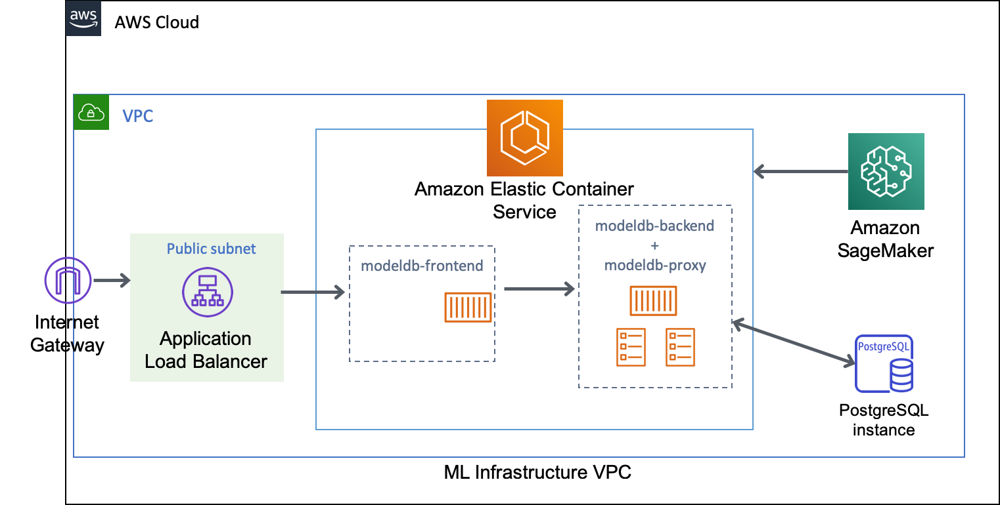
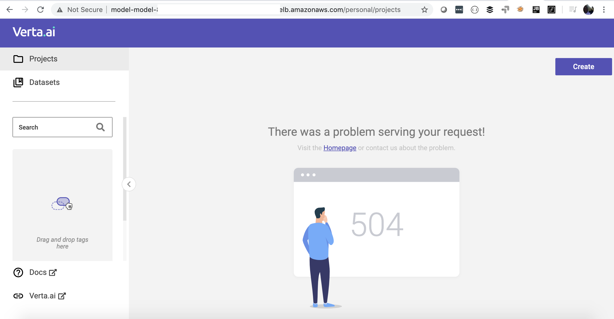

[Verta.ai](https://www.verta.ai/) ModelDB on [Amazon Web Services](https://aws.amazon.com/)
===========================================================================================

What is ModelDB?
---
ModelDB is an end-to-end system for tracking, versioning and auditing machine learning models. It ingests models and associated metadata as models are being trained, stores model data in a structured format, and surfaces it through a web-frontend for rich querying and the python client.

Visit [ModelDB code repository](https://github.com/VertaAI/modeldb) for more details.


Why ModelDB on AWS?
---
The vision for this project is to develop AI Platform capabilities integrated with Amazon SageMaker. Amazon SageMaker currently comes with its own experiment tracking, model versioning features. However, data versioning is not yet available. We have added examples notebooks to demonstrate how to integrate ModelDB data versioning into your Amazon SageMaker workflow. 

In addition, we are working on full integration with Amazon SageMaker Experiments API and/or training logs so as to provide a unified experience in machine learning workflow. We do not have a defined roadmap yet, but we hope the project matures as it simplifies machine learning workflows.


Architecture
---



Deployment
---
This project is deployed via [Amazon Cloudformation](https://aws.amazon.com/cloudformation/) using the [AWS Cloud Development Kit](https://aws.amazon.com/cdk). Follow the steps below to deploy the stack in your AWS Account.

```bash
$ sudo npm install -g aws-cdk
$ cd stack
$ npm install -s
$ cdk deploy -y
```

The stack creates the following AWS resources:
- [Amazon VPC](https://aws.amazon.com/vpc/)
- [Amazon Elastic Container Service](https://aws.amazon.com/ecs/)
- [Amazon RDS (Postgres)](https://aws.amazon.com/rds/)


After a successful deployment, you should be able to access ModelDB frontend UI.




Amazon SageMaker Integration
---
As shown in the architecture diagram above, we have integrated [ModelDB](https://github.com/VertaAI/modeldb) with Amazon SageMaker. 
For easier deployment, all Amazon SageMaker infrastructure such as SageMaker Notebooks, Model Training jobs, SageMaker Processing jobs, are launched in the same
[Amazon Virtual Private Cloud](https://aws.amazon.com/vpc). For more complicated deployments as having the infrastructure in separate VPCs, you may consider [VPC Peering](https://docs.aws.amazon.com/vpc/latest/peering/what-is-vpc-peering.html), this however is not covered here.


#### Amazon SageMaker examples with ModelDB (Coming soon)
1. Data Versioning
2. Logging and Querying a Model Metadata
3. So much more ...